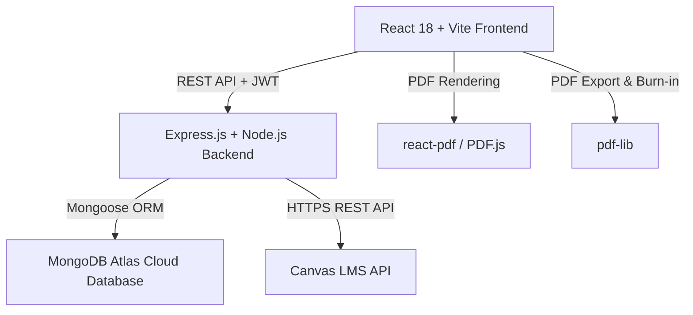

# 📚 AssignmentTracker Codebase Comprehensive Overview

## 📌 Executive Summary

**AssignmentTracker** (also styled as **Todo App**) is a modern full-stack web application designed for students and professionals to track assignments, manage daily todo lists, organize course materials, sync Canvas LMS assignments, import ICS calendar files, and view/annotate PDF documents directly within the browser.

---

## 🛠️ Architecture & Tech Stack



### 1. Frontend Architecture
- **Framework**: React 18 initialized via Vite
- **Styling**: TailwindCSS 3.3, PostCSS, and custom utility [cn()](file:///c:/Users/sarve/Documents/Desktop%20Contents/GitHub%20Repositories/AssignmentTracker/frontend/src/lib/utils.js#4-7) (`clsx` + `tailwind-merge`)
- **Icons**: `lucide-react`
- **Authentication Context**: [AuthContext.jsx](file:///c:/Users/sarve/Documents/Desktop%20Contents/GitHub%20Repositories/AssignmentTracker/frontend/src/contexts/AuthContext.jsx) manages token state & persistence via `localStorage`
- **PDF Subsystem**:
  - **Viewer**: `react-pdf` (PDF.js worker integration)
  - **Annotation Engine**: Overlay SVG layer capturing pen strokes, highlighter transparency, eraser tools, and pointer pressure sensitivity.
  - **PDF Exporter**: `pdf-lib` renders vector stroke paths directly onto PDF page buffers before triggering downloads.

### 2. Backend Architecture
- **Runtime**: Node.js with Express.js ([backend/server.js](file:///c:/Users/sarve/Documents/Desktop%20Contents/GitHub%20Repositories/AssignmentTracker/backend/server.js))
- **Database Connection**: Mongoose ODM connecting to MongoDB Atlas (`MONGODB_URI`)
- **Authentication & Security**:
  - Passwords hashed using `bcryptjs` (salt factor 10)
  - Sessions managed via JSON Web Tokens (`jsonwebtoken`) expiring in 7 days
  - [authenticateToken](file:///c:/Users/sarve/Documents/Desktop%20Contents/GitHub%20Repositories/AssignmentTracker/backend/server.js#217-234) Express middleware enforcing route authorization
- **File Upload handling**: `multer` with memory storage strategy (files stored directly as binary `Buffer` in MongoDB)

---

## 🗄️ Database Schemas (Mongoose)

### 1. User Schema ([User](file:///c:/Users/sarve/Documents/Desktop%20Contents/GitHub%20Repositories/AssignmentTracker/frontend/src/App.jsx#579-588))
- `username`: String (required, unique, trimmed)
- `email`: String (required, unique, trimmed, lowercase)
- `password`: String (bcrypt hash)
- `canvasUrl`: String (Canvas instance URL, e.g. `https://canvas.instructure.com`)
- `canvasToken`: String (Personal Access Token)
- `lastCanvasSync`: Date
- `createdAt`: Date (default: `Date.now`)

### 2. Folder Schema ([Folder](file:///c:/Users/sarve/Documents/Desktop%20Contents/GitHub%20Repositories/AssignmentTracker/frontend/src/App.jsx#949-985))
- `name`: String (required)
- `color`: String (default: `'#0ea5e9'`)
- `user`: ObjectId (ref: [User](file:///c:/Users/sarve/Documents/Desktop%20Contents/GitHub%20Repositories/AssignmentTracker/frontend/src/App.jsx#579-588))
- `createdAt`: Date

### 3. Todo Schema ([Todo](file:///c:/Users/sarve/Documents/Desktop%20Contents/GitHub%20Repositories/AssignmentTracker/frontend/src/App.jsx#391-431))
- [text](file:///c:/Users/sarve/Documents/Desktop%20Contents/GitHub%20Repositories/AssignmentTracker/frontend/src/App.jsx#1088-1097): String (required task title)
- `description`: String
- `links`: Array of Strings
- `status`: String (`'todo'`, `'in-progress'`, `'completed'`)
- `folder`: ObjectId (ref: [Folder](file:///c:/Users/sarve/Documents/Desktop%20Contents/GitHub%20Repositories/AssignmentTracker/frontend/src/App.jsx#949-985), optional)
- `user`: ObjectId (ref: [User](file:///c:/Users/sarve/Documents/Desktop%20Contents/GitHub%20Repositories/AssignmentTracker/frontend/src/App.jsx#579-588), required)
- `createdAt`: Date
- `completedAt`: Date
- `dueDate`: Date
- `canvasId`: String (unique identifier from Canvas for deduplication)
- `canvasType`: String (`'assignment'`, `'calendar_event'`, or `null`)

### 4. PDF Schema ([PDF](file:///c:/Users/sarve/Documents/Desktop%20Contents/GitHub%20Repositories/AssignmentTracker/frontend/src/components/PDFEditor.jsx#78-134))
- `name`: String (display title)
- `originalName`: String
- `pdfData`: Buffer (raw binary file content stored in MongoDB)
- `annotations`: Array of stroke objects (points, pressure, color, strokeWidth, tool, page)
- `tags`: Array of Strings
- `pdfFolder`: ObjectId (ref: [PDFFolder](file:///c:/Users/sarve/Documents/Desktop%20Contents/GitHub%20Repositories/AssignmentTracker/frontend/src/App.jsx#295-327), optional)
- `user`: ObjectId (ref: [User](file:///c:/Users/sarve/Documents/Desktop%20Contents/GitHub%20Repositories/AssignmentTracker/frontend/src/App.jsx#579-588), required)
- `todo`: ObjectId (ref: [Todo](file:///c:/Users/sarve/Documents/Desktop%20Contents/GitHub%20Repositories/AssignmentTracker/frontend/src/App.jsx#391-431), optional link to assignment)
- `createdAt` & `updatedAt`: Date

### 5. PDF Folder Schema ([PDFFolder](file:///c:/Users/sarve/Documents/Desktop%20Contents/GitHub%20Repositories/AssignmentTracker/frontend/src/App.jsx#295-327))
- `name`: String (required)
- `color`: String (default: `'#3b82f6'`)
- `description`: String
- `user`: ObjectId (ref: [User](file:///c:/Users/sarve/Documents/Desktop%20Contents/GitHub%20Repositories/AssignmentTracker/frontend/src/App.jsx#579-588), required)
- `createdAt`: Date

---

## 🔌 API Route Reference ([backend/server.js](file:///c:/Users/sarve/Documents/Desktop%20Contents/GitHub%20Repositories/AssignmentTracker/backend/server.js))

| Category | Method | Route | Description |
| :--- | :--- | :--- | :--- |
| **Auth** | `POST` | `/api/auth/register` | Register a new user & receive JWT token |
| | `POST` | `/api/auth/login` | Authenticate existing user & receive JWT token |
| **Todos** | `GET` | `/api/todos` | Fetch all todos for authenticated user |
| | `POST` | `/api/todos` | Create a new todo item |
| | `PUT` | `/api/todos/:id` | Update status, text, description, links, due dates |
| | `DELETE` | `/api/todos/:id` | Delete a single todo |
| | `DELETE` | `/api/todos/folder/:folderId` | Bulk delete todos within a folder |
| | `DELETE` | `/api/todos/clear-inbox` | Bulk delete uncategorized todos |
| **Folders**| `GET` | `/api/folders` | Fetch user's task folders |
| | `POST` | `/api/folders` | Create a new task folder |
| | `PUT` | `/api/folders/:id` | Update folder name/color |
| | `DELETE` | `/api/folders/:id` | Delete folder & cascade delete associated todos |
| **Canvas LMS**| `GET/PUT` | `/api/user/canvas` | Retrieve/Update user Canvas LMS URL & API Token |
| | `POST` | `/api/canvas/test` | Test connection to Canvas API |
| | `POST` | `/api/canvas/sync` | Fetch & import Canvas courses, assignments, and calendar events |
| **Calendar**| `POST` | `/api/calendar/import` | Upload `.ics` file; parse course names & import events as todos |
| **PDFs** | `GET` | `/api/pdfs` | Fetch all user PDFs metadata |
| | `GET` | `/api/pdfs/:id` | Fetch single PDF with Base64 encoded `pdfData` buffer |
| | `POST` | `/api/pdfs` | Upload a new PDF file (`multer` single file upload) |
| | `PUT` | `/api/pdfs/:id` | Update PDF name, tags, or assigned PDF folder |
| | `PUT` | `/api/pdfs/:id/annotations` | Auto-save annotation drawing paths |
| | `GET` | `/api/pdfs/:id/download` | Download raw original binary PDF file |
| | `DELETE` | `/api/pdfs/:id` | Delete PDF document |
| **PDF Folders**| `GET/POST` | `/api/pdf-folders` | List or create PDF categories |
| | `PUT/DELETE` | `/api/pdf-folders/:id` | Update or delete PDF category (moves PDFs to uncategorized) |
| **System** | `GET` | `/api/health` | Health check endpoint |

---

## 🎨 Key Application Features & Frontend Capabilities

1. **Kanban & List Task Management ([frontend/src/App.jsx](file:///c:/Users/sarve/Documents/Desktop%20Contents/GitHub%20Repositories/AssignmentTracker/frontend/src/App.jsx))**:
   - Status transitions (`todo` ➔ `in-progress` ➔ `completed`) via click cycling or drag-and-drop.
   - Categorization by folders with custom colors.
   - Filterable view: "All Tasks", specific folders, or "Inbox".
   - Sorting options by Creation Date, Due Date, Name, and Status.
   - Celebration micro-animations upon task completion.

2. **In-Browser PDF Annotation Suite ([frontend/src/components/PDFEditor.jsx](file:///c:/Users/sarve/Documents/Desktop%20Contents/GitHub%20Repositories/AssignmentTracker/frontend/src/components/PDFEditor.jsx))**:
   - Complete toolbar supporting Pen, Highlighter (with opacity control), and Eraser tools.
   - Pressure sensitivity detection (`e.pressure`) for realistic stylus drawing.
   - Auto-save timer (1-second debounce after stroke release).
   - High-fidelity PDF export: uses `pdf-lib` to burn SVG paths into the native PDF stream so annotations remain vector-crisp when downloaded.

3. **External Integrations**:
   - **Canvas LMS Integration**: Connects via API token to auto-pull assignments and due dates directly into the user's dashboard.
   - **ICS File Parser**: Accepts standard iCalendar files (e.g. exported from university schedules), detects course codes like `CS101` using regular expressions, and creates corresponding folders automatically.

4. **Power User CLI Menu (`Tab` Key Overlay)**:
   - Built-in command modal allowing users to execute quick CLI actions such as `sort due`, `folder Math`, [clear](file:///c:/Users/sarve/Documents/Desktop%20Contents/GitHub%20Repositories/AssignmentTracker/frontend/src/App.jsx#1104-1139), `all`, `inbox`, and batch deletion `del [count]`.

---

## 🚀 Environment & Run Commands

### Environment Setup ([.env](file:///c:/Users/sarve/Documents/Desktop%20Contents/GitHub%20Repositories/AssignmentTracker/.env))
```env
MONGODB_URI=mongodb+srv://<username>:<password>@cluster.mongodb.net/todoapp?retryWrites=true&w=majority
PORT=5000
JWT_SECRET=your_jwt_secret_key_here
```

### Development Execution
```bash
# Terminal 1: Backend API
cd backend
npm run dev    # Runs server.js with nodemon on http://localhost:5000

# Terminal 2: Frontend Client
cd frontend
npm run dev    # Runs Vite dev server on http://localhost:3000
```
